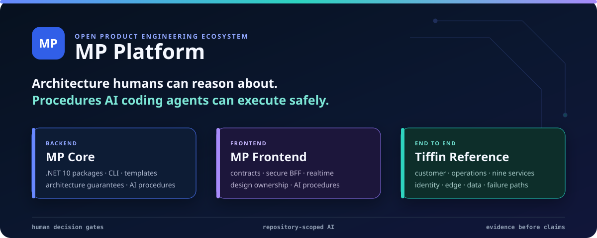
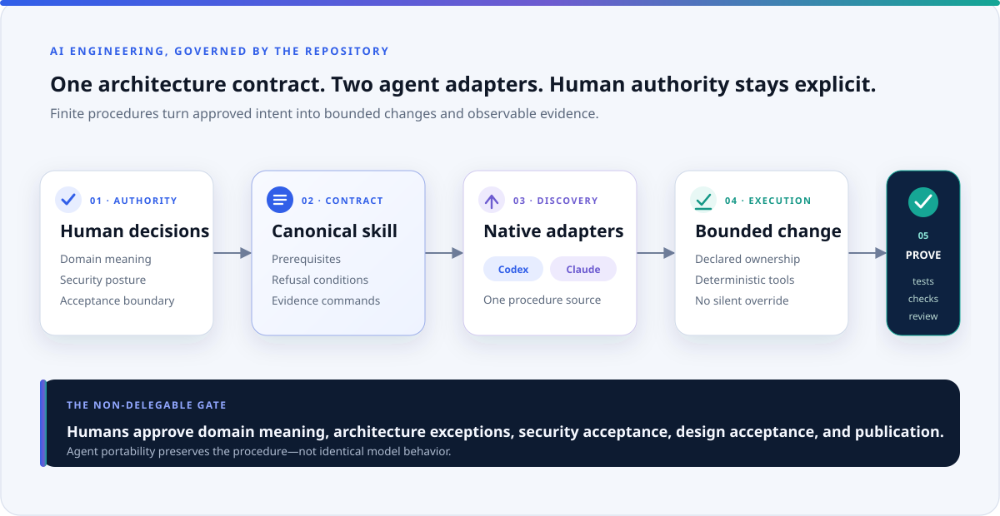
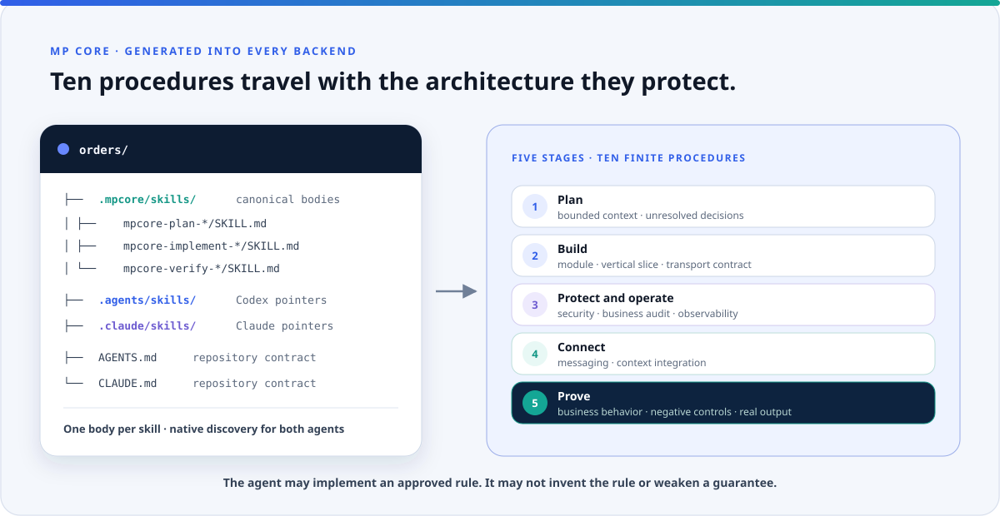
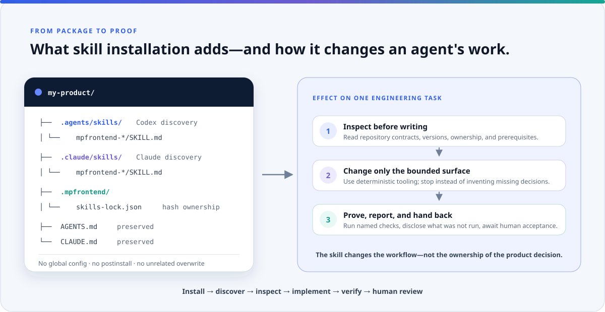
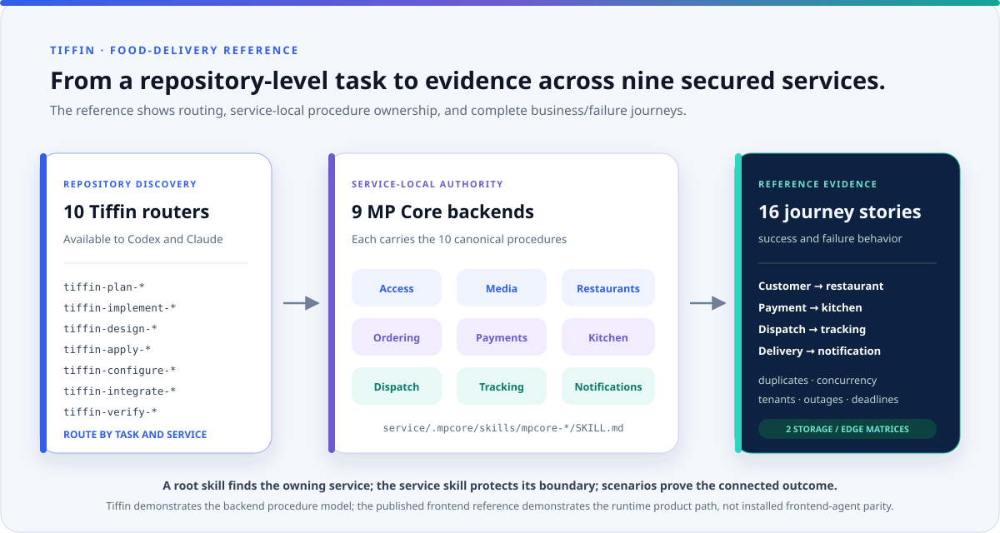
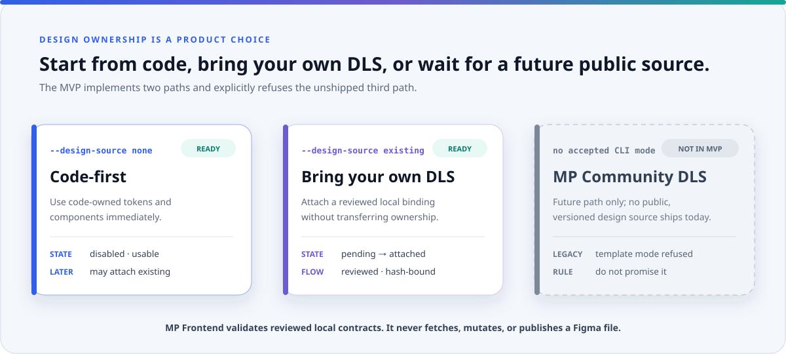

<div align="center">

# MP Platform

**Architecture humans can reason about—and AI coding agents can execute safely.**

Open foundations for contract-driven product engineering, backed by runnable reference systems,
explicit trust boundaries, deterministic tooling, repository-scoped AI procedures, and evidence that
says exactly what was tested.

[](https://github.com/panahister/mp-platform/actions/workflows/ci.yml)
[](LICENSE)
[](https://github.com/panahister/mpcore)
[](https://github.com/panahister/mpfrontend)
[](docs/maturity.md)

[Choose a path](#choose-your-path) ·
[Run Tiffin locally](docs/local-workflows.md) ·
[Engineering conventions](docs/engineering-workflows.md) ·
[Explore the architecture](docs/architecture.md) ·
[AI engineering](docs/ai-engineering.md) ·
[Design sources](docs/design-sources.md) ·
[Map the repositories](docs/repositories.md) ·
[Understand the evidence](docs/maturity.md) ·
[Contribute](CONTRIBUTING.md)

</div>



## One platform, three adoption paths

MP Platform is deliberately composable. A team does not have to adopt the entire ecosystem to receive
value from one part of it.

| Path | Start with | What you receive | Best for |
|---|---|---|---|
| **Backend** | [MP Core](https://github.com/panahister/mpcore) | .NET packages, CLI, templates, architecture rules, messaging, idempotency, security, observability, and AI procedures | Teams building modular monoliths or services on .NET 10 |
| **Frontend** | [MP Frontend](https://github.com/panahister/mpfrontend) | Contract normalization, deterministic generation, a secure BFF boundary, realtime recovery, localization, design-source integration, and AI procedures | React and Next.js teams that already own—or are creating—their product design system |
| **End to end** | [Tiffin](https://github.com/panahister/mpcore-tiffin-sample) | A runnable food-delivery reference with nine services, customer and operations applications, Keycloak identity, APISIX edge policy, two S3-compatible stores, and complete business journeys | Teams evaluating the foundations together against realistic success and failure paths |

The [adoption guide](docs/adoption.md) gives each path a bounded first evaluation, expected evidence, and
an exit point. It does not force a platform-wide migration.

## Why MP Platform exists

Most product teams repeatedly rebuild the same architectural decisions while deadlines reward shortcuts:
transaction boundaries, duplicate requests, message delivery, token custody, contract drift, realtime
recovery, localization, design ownership, and rules for AI-generated code.

MP Platform makes those decisions explicit and reusable.

| Product pressure | Common failure | MP Platform response |
|---|---|---|
| A change and its event must agree | Data commits while its message is lost—or the reverse | Transactional application boundaries, outbox/inbox processing, retries, and idempotency in MP Core |
| Backend contracts evolve faster than clients | Handwritten models silently drift | Reviewed OpenAPI inputs, normalized contracts, runtime validation, and generated ownership boundaries in MP Frontend |
| Authentication spreads through browser code | Provider tokens and internal origins leak into the client | Opaque application sessions, a Security BFF, an explicit gateway, and backend authorization on every protected service |
| Realtime reconnects lose state or authority | A reconnect trusts stale access or drops events | Ticketed admission, replay, snapshots, leases, revocation, and negative controls |
| Every product starts with a different design system | A framework takes ownership of product branding | Code-first and consumer-owned existing-design paths; no private design source is copied or published |
| AI agents improvise local conventions | Code compiles while breaking architecture | Finite repository-scoped procedures backed by deterministic tools and human decision gates |
| A sample demonstrates only the happy path | Production failures remain invisible until later | Runnable references that exercise duplicates, concurrency, outages, compensation, tenant isolation, and stale identity claims |

## AI engineering is part of the architecture

MP Platform does not treat an AI coding agent as an unbounded code generator. It gives the agent a
finite procedure for the task, the repository's declared architecture, refusal conditions, deterministic
tools, and the checks that must produce evidence before the change is accepted.

<picture>
  <source media="(prefers-color-scheme: dark)" srcset="docs/images/ai-engineering-dark.svg">
  <source media="(prefers-color-scheme: light)" srcset="docs/images/ai-engineering-light.svg">
  
</picture>

| Capability | Backend | Frontend |
|---|---|---|
| Product procedures | **10** generated MP Core skills covering context planning through business-behavior verification | **18** MP Frontend skills: 14 Base workflows plus 4 optional Design workflows |
| Agent discovery | One canonical skill body, discovered by Codex through `AGENTS.md` and by Claude Code through `CLAUDE.md` | One packaged source, installed repository-locally for Codex, Claude Code, or both |
| Guardrail | The agent refuses to invent domain rules, weaken security, or report unobserved tests | The CLI refuses collisions, concurrent installation, unowned overwrites, and unreviewed design-source changes |
| Proof boundary | The skill names the tests or scenarios required for the guarantee it changes | Format and CLI gates prove procedure installation; product behavior and visual acceptance still require review |

### Backend skill structure

<picture>
  <source media="(prefers-color-scheme: dark)" srcset="docs/images/backend-skills-dark.svg">
  <source media="(prefers-color-scheme: light)" srcset="docs/images/backend-skills-light.svg">
  
</picture>

### Frontend skill installation and effect

<picture>
  <source media="(prefers-color-scheme: dark)" srcset="docs/images/skill-lifecycle-dark.svg">
  <source media="(prefers-color-scheme: light)" srcset="docs/images/skill-lifecycle-light.svg">
  
</picture>

### Food-delivery reference: routing skills into evidence

<picture>
  <source media="(prefers-color-scheme: dark)" srcset="docs/images/tiffin-ai-reference-dark.svg">
  <source media="(prefers-color-scheme: light)" srcset="docs/images/tiffin-ai-reference-light.svg">
  
</picture>

Tiffin's ten repository-level backend skills route a task to the canonical MP Core procedure inside the
owning service. All nine services carry the ten generated product procedures. Sixteen business and
failure stories then prove the connected result in two infrastructure matrices. The Tiffin frontend
proves the customer and operations runtime reference; it does not claim installed MP Frontend agent-skill
acceptance, which remains owned and verified by the reusable frontend foundation.

MP Core also carries three maintainer-only procedures for evolving a package, scaffolding a consumer, and
preparing a release. They are deliberately separate from the ten product procedures generated into a
backend. MP Frontend installs skills explicitly—never from `postinstall` and never into personal or global
agent configuration.

The outcome is **procedure-source portability**, not a claim that every model will reason identically.
Humans still approve domain meaning, architecture boundaries, security posture, design acceptance, and
publication. The [AI engineering guide](docs/ai-engineering.md) documents every skill, the installation
model, the delivery lifecycle, the evidence, and the limitations.

## Design-system choices are explicit

<picture>
  <source media="(prefers-color-scheme: dark)" srcset="docs/images/design-sources-dark.svg">
  <source media="(prefers-color-scheme: light)" srcset="docs/images/design-sources-light.svg">
  
</picture>

The MVP supports two real paths: `none` for code-first products and `existing` for a product that already
owns a Figma/DLS. The connector validates a reviewed local export and never fetches, mutates, copies, or
publishes the source file. A future MP Community DLS is intentionally **not available in the MVP**; the
legacy template mode is refused so configuration cannot imply that an unshipped public library exists.

This is not a blocker. Teams can use all non-design MP Frontend capabilities with `none`, or add the four
Design skills to a reviewed `existing` workflow. The [design-source guide](docs/design-sources.md) shows
the modes, lifecycle, generated/authored ownership, rights boundary, commands, and future release gate.

## The ecosystem

<picture>
  <source media="(prefers-color-scheme: dark)" srcset="docs/images/ecosystem-dark.svg">
  <source media="(prefers-color-scheme: light)" srcset="docs/images/ecosystem-light.svg">
  
</picture>

Two repositories are reusable foundations. Product references own their business behavior. Integration
repositories own identity and edge policy. No product imports another product's private design source,
credentials, or runtime state.

| Layer | Repository | Owns |
|---|---|---|
| Backend foundation | [`mpcore`](https://github.com/panahister/mpcore) | .NET runtime packages, CLI, templates, backend architecture, and backend AI procedures |
| Frontend foundation | [`mpfrontend`](https://github.com/panahister/mpfrontend) | Frontend packages, CLI, contract tooling, runtime boundaries, and frontend AI procedures |
| Full backend reference | [`mpcore-tiffin-sample`](https://github.com/panahister/mpcore-tiffin-sample) | Food-delivery business behavior across nine independently secured services |
| Full frontend reference | [`mpfrontend-tiffin-reference`](https://github.com/panahister/mpfrontend-tiffin-reference) | Customer and operations applications, product adapters, localization, and theme ownership |
| Identity boundary | [`tiffin-keycloak`](https://github.com/panahister/tiffin-keycloak) | Identity, credentials, authorization seed, lifecycle events, and authentication theme |
| Edge boundary | [`tiffin-apisix`](https://github.com/panahister/tiffin-apisix) | Declarative REST/gRPC routing, correlation, throttling, TLS input, and optional token pre-validation |
| Backend learning reference | [`mpcore-storefront-sample`](https://github.com/panahister/mpcore-storefront-sample) | A commerce modular monolith plus services and focused backend architecture evidence |

[Repository ownership](docs/repositories.md) explains what each repository deliberately does not own.

## Choose your path

### Backend foundation

Install the published MP Core `0.9.3` CLI and template:

```bash
dotnet tool install --global MPCore.Cli --version 0.9.3
dotnet new install MPCore.Templates::0.9.3
```

Create a backend with explicit architecture choices:

```bash
mpcore new backend \
  --organization Acme \
  --component Orders \
  --output ./orders \
  --shape modular-monolith \
  --transport both \
  --messaging kafka \
  --cache hybrid \
  --business-audit postgresql
```

Continue with the [MP Core getting-started guide](https://github.com/panahister/mpcore/blob/main/docs/guide/getting-started.md).

### Frontend foundation

MP Frontend is currently a public source POC; its packages are not yet published to a registry. Evaluate
the exact source and its independent-consumer gate:

```bash
git clone https://github.com/panahister/mpfrontend.git
cd mpfrontend
pnpm install --frozen-lockfile
pnpm check --skip-nx-cache
pnpm pack:local
pnpm exec nx run distribution:consumer-check
```

Choose `none` for a code-first design source or `existing` for an approved consumer-owned Figma/DLS
export. MP Frontend validates local reviewed artifacts; it does not request design credentials, mutate the
source file, or publish it. Continue with the [frontend guide](https://github.com/panahister/mpfrontend/blob/main/docs/GETTING-STARTED.md).

### Full-stack reference

Tiffin has three supported local workflows. Choose the row that matches what you want to edit:

| Workflow | Docker runs | You run from source | What it gives you | First command |
|---|---|---|---|---|
| **Hybrid Mode** | Infrastructure, identity, edge, and frontend | Nine .NET services | Service breakpoints, migrations, message-flow diagnostics, and all real product boundaries | `scripts/up.sh` |
| **Frontend Mode** | Complete seeded backend, identity, and edge | Customer, Operations, and both BFFs | Next.js hot reload, BFF/session debugging, real identities, roles, APIs, media, and realtime behavior without local .NET | `scripts/full-demo.sh up-backend` |
| **Full Demo Mode** | The entire product | Nothing | A health-checked, source-built, seeded product evaluation without installing Node.js or .NET | `scripts/full-demo.sh up` |

Clone the four source boundaries as siblings:

```bash
git clone https://github.com/panahister/mpcore-tiffin-sample.git
git clone https://github.com/panahister/mpfrontend-tiffin-reference.git
git clone https://github.com/panahister/tiffin-keycloak.git
git clone https://github.com/panahister/tiffin-apisix.git
```

Run the mode that matches your work. Each block starts from the sibling layout above.

<details>
<summary><strong>Hybrid Mode — debug the nine backend services on the host</strong></summary>

```bash
cd mpcore-tiffin-sample
scripts/up.sh
scripts/setup.sh
scripts/run.sh all
python3 scripts/seed-us-poc.py

cd ../mpfrontend-tiffin-reference
node scripts/verify-core-artifacts.mjs
pnpm install --frozen-lockfile
docker compose -f compose.local.yaml up --detach --build --wait
```

Verify Customer and Operations, then run the complete backend scenarios:

```bash
curl --fail --silent http://localhost:4411/ >/dev/null
curl --fail --silent http://localhost:4412/ >/dev/null
cd ../mpcore-tiffin-sample
scripts/scenarios.sh
```

</details>

<details>
<summary><strong>Frontend Mode — run Customer, Operations, and both BFFs from source</strong></summary>

```bash
cd mpcore-tiffin-sample
scripts/full-demo.sh up-backend

cd ../mpfrontend-tiffin-reference
node scripts/verify-core-artifacts.mjs
pnpm install --frozen-lockfile
pnpm dev:product
```

Open Customer at `http://localhost:4411` and Operations at `http://localhost:4412`. The Docker backend
and seeded data remain running when the host frontend is stopped.

</details>

<details>
<summary><strong>Full Demo Mode — evaluate the complete product with Git and Docker only</strong></summary>

```bash
cd mpcore-tiffin-sample
scripts/full-demo.sh up
```

Open Customer at `http://localhost:4411` and Operations at `http://localhost:4412`. The command builds
every application image from the checked-out source, waits for health, and applies the idempotent US demo
seed through product APIs.

</details>

Normal stop preserves local data. For Frontend Mode or Full Demo Mode:

```bash
cd mpcore-tiffin-sample
scripts/full-demo.sh down
```

For Hybrid Mode, stop the frontend, host services, and dependencies in that order:

```bash
cd mpfrontend-tiffin-reference
docker compose -f compose.local.yaml down

cd ../mpcore-tiffin-sample
scripts/run.sh stop
scripts/down.sh
```

Use `scripts/full-demo.sh reset` or `scripts/down.sh --volumes` only when deleting local demo state is
intentional. Do not run two modes together; they deliberately use the same product origins and ports.

The [local-workflow guide](docs/local-workflows.md) explains prerequisites, exact commands, what runs
where, first-run behavior, trade-offs, URLs, observability, RustFS/SeaweedFS selection, and safe
stop/reset semantics. It then routes backend work to the
[backend running guide](https://github.com/panahister/mpcore-tiffin-sample/blob/main/docs/running.md) and
frontend work to the
[frontend local-development guide](https://github.com/panahister/mpfrontend-tiffin-reference/blob/main/docs/LOCAL-DEVELOPMENT.md).

## Evidence before claims

Every project distinguishes source verification from production certification. The public evidence
currently includes:

- MP Core package, compatibility, integration, and reference-consumer gates on .NET 10.
- MP Frontend lint, typecheck, test, build, immutable archive, independent-consumer, Redis session,
  dependency-audit, and deliberate negative-control gates.
- Tiffin backend Release verification with 313 tests plus complete RustFS/edge-off and
  SeaweedFS/Keycloak-edge scenario matrices on GitHub.
- Tiffin frontend verification across nineteen uncached lint, typecheck, test, build, generated-contract,
  and theme targets.
- Real food-delivery success, compensation, concurrency, idempotency, tenant-isolation, identity,
  service-outage, media, tracking, and notification journeys.

This evidence establishes a reusable public POC and reference implementation. It does **not** claim
production HA, deployment approval, load qualification, formal accessibility certification, managed
secret custody, regional failover, or published MP Frontend registry packages. Read the
[maturity and evidence boundary](docs/maturity.md) before adopting the platform.

## Principles

1. **Business behavior stays in products.** Foundations provide guarantees and boundaries, not a domain.
2. **Identity has one source of truth.** Product projections never become credential authorities.
3. **The browser is outside the trusted network.** Tokens and internal origins stay behind the BFF.
4. **Generated code has finite ownership.** A generator may not overwrite product decisions.
5. **A defect is fixed where it belongs.** References do not hide foundation defects with local workarounds.
6. **Evidence names its limits.** A green source suite is not a production certificate.
7. **AI follows procedures, not hidden conventions.** Human decisions and refusal paths remain explicit.

## Project navigation

| Goal | Read next |
|---|---|
| Understand runtime and trust boundaries | [Architecture](docs/architecture.md) |
| Understand AI procedures, agent discovery, and human gates | [AI engineering](docs/ai-engineering.md) |
| Choose code-first, existing DLS, or understand the deferred Community path | [Design-source paths](docs/design-sources.md) |
| Evaluate one part without adopting everything | [Adoption paths](docs/adoption.md) |
| Run or debug the complete Tiffin reference | [Local workflows](docs/local-workflows.md) |
| Follow the standard backend/frontend feature path | [Engineering workflows](docs/engineering-workflows.md) |
| Find the right repository for an issue or contribution | [Repository map](docs/repositories.md) |
| Understand what is proven and what remains open | [Maturity](docs/maturity.md) |
| Propose an ecosystem-level change | [Contributing](CONTRIBUTING.md) |
| Report a cross-repository vulnerability | [Security policy](SECURITY.md) |

## License

The hub documentation and artwork are licensed under [Apache License 2.0](LICENSE). Each linked
repository carries its own license and third-party notices. Product and technology names are used only
to identify the corresponding projects.
