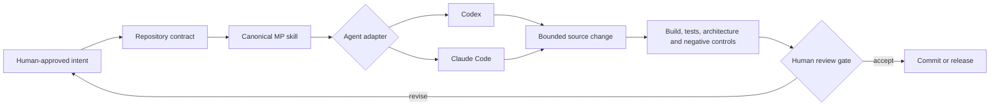

# AI engineering

MP Platform turns architecture guidance into finite, repository-scoped procedures that AI coding agents
can discover and follow. The objective is not autonomous product ownership. It is repeatable engineering:
the same approved architecture, refusal rules, deterministic tools, and evidence expectations remain
visible whether a team uses Codex, Claude Code, or works manually.

## The operating model

<picture>
  <source media="(prefers-color-scheme: dark)" srcset="images/ai-engineering-dark.svg">
  <source media="(prefers-color-scheme: light)" srcset="images/ai-engineering-light.svg">
  
</picture>

An MP skill is a procedure, not a prompt fragment. It tells an agent:

- what must already be approved before work starts;
- which repository contracts and manifests to inspect;
- what the agent may implement and what it must refuse to decide;
- which security, ownership, and compatibility boundaries must remain intact;
- which commands and negative cases produce evidence;
- what a human must still review before a change is accepted or published.



The agent adapter changes discovery, not the engineering contract. Publication, release, architecture
exceptions, domain meaning, and security acceptance remain human decisions.

## Frontend repository installation and task effect

<picture>
  <source media="(prefers-color-scheme: dark)" srcset="images/skill-lifecycle-dark.svg">
  <source media="(prefers-color-scheme: light)" srcset="images/skill-lifecycle-light.svg">
  
</picture>

For MP Frontend, installing for both agents writes the selected canonical skill bodies below
`.agents/skills` and `.claude/skills`, then records owned file hashes in
`.mpfrontend/skills-lock.json`. Existing `AGENTS.md`, `CLAUDE.md`, and unrelated skills are preserved.
MP Core uses the same one-body/two-adapter principle, but generated backend procedures live canonically
inside `.mpcore/skills`; the next section shows that distinct structure.

The visible result is not merely another instruction folder. It changes the task lifecycle: inspect the
repository contract before writing, limit the change to declared ownership, stop at missing human
decisions, execute named evidence, and disclose everything that was not proved.

## Backend procedures

Every backend generated by MP Core carries ten product procedures in `.mpcore/skills`. Codex discovers
the canonical bodies through `AGENTS.md` and `.agents/skills`; Claude Code discovers the same bodies
through `CLAUDE.md` and `.claude/skills`.

<picture>
  <source media="(prefers-color-scheme: dark)" srcset="images/backend-skills-dark.svg">
  <source media="(prefers-color-scheme: light)" srcset="images/backend-skills-light.svg">
  
</picture>

| Skill | Bounded responsibility |
|---|---|
| `mpcore-plan-bounded-context` | Convert an approved context into aggregates, invariants, commands, queries, and explicit unresolved decisions |
| `mpcore-implement-ddd-module` | Create and register a compiling module shell without inventing business behavior |
| `mpcore-implement-vertical-slice` | Implement one approved capability through domain, application, persistence, transport, authorization, and tests |
| `mpcore-design-transport-contract` | Design a REST or gRPC contract and identify compatibility consequences |
| `mpcore-configure-messaging` | Declare topics or queues, delivery policy, retry behavior, partitioning, and terminal failure handling |
| `mpcore-apply-security` | Apply token-derived role and resource authorization with negative tests |
| `mpcore-apply-business-audit` | Record the accountable business action while excluding prohibited or sensitive data |
| `mpcore-apply-observability` | Add actionable signals without leaking secrets into logs, labels, or messages |
| `mpcore-integrate-contexts` | Connect contexts or services through explicit contracts and tested integration boundaries |
| `mpcore-verify-business-behavior` | Prove the business rule and the technical guarantee with observed checks |

MP Core itself has three maintainer procedures—`mpcore-evolve-package`, `mpcore-scaffold-backend`, and
`mpcore-release`. These govern framework maintenance and are not copied into a generated product as part
of the ten-skill product catalog.

Select repository discovery when generating a backend:

```bash
mpcore new backend \
  --organization Acme \
  --component Orders \
  --output ./orders \
  --shape modular-monolith \
  --transport both \
  --messaging kafka \
  --ai-tooling both
```

The skills read the generated manifest before acting. They do not fill an ambiguous domain rule with a
guess, weaken a security default to make a test pass, or report a test that was not observed.

## Frontend procedures

MP Frontend packages eighteen procedures. The Base profile contains fourteen implementation and
integration workflows. The Design profile adds four finite workflows for a reviewed, consumer-owned
local design export.

| Profile | Skills |
|---|---|
| Base: foundation | `mpfrontend-scaffold-app`, `mpfrontend-implement-feature`, `mpfrontend-use-ui`, `mpfrontend-configure-theme`, `mpfrontend-configure-i18n` |
| Base: contracts and data | `mpfrontend-integrate-openapi`, `mpfrontend-table-from-api`, `mpfrontend-form-from-api` |
| Base: runtime boundaries | `mpfrontend-integrate-auth`, `mpfrontend-apply-access`, `mpfrontend-integrate-realtime` |
| Base: lifecycle | `mpfrontend-verify-frontend`, `mpfrontend-upgrade-project`, `mpfrontend-prepare-release` |
| Design extension | `mpfrontend-import-design-system`, `mpfrontend-sync-design-tokens`, `mpfrontend-reconcile-design-components`, `mpfrontend-review-design-drift` |

Install the same packaged source for Codex, Claude Code, or both:

```bash
mpfrontend skills list --json
mpfrontend skills install \
  --directory ./my-product \
  --for both \
  --profile base \
  --dry-run \
  --json
mpfrontend skills install --directory ./my-product --for both --profile base --json
mpfrontend skills check --directory ./my-product --json
```

Installation is explicit and repository-local. It never runs during package `postinstall`, writes global
agent configuration, or replaces unrelated skills. It is idempotent for its owned content. A locally
modified or unowned destination causes a collision; an exclusive repository lock makes concurrent or
interrupted installation fail closed. Dry-run performs no writes.

Design procedures do not read from or write to Figma. They consume a finite reviewed local export and
hash-bound evidence. Importing or generating a component registry is not automatic visual acceptance,
React implementation, or permission to publish a private design source.

## Tiffin: the procedure model in a real backend system

<picture>
  <source media="(prefers-color-scheme: dark)" srcset="images/tiffin-ai-reference-dark.svg">
  <source media="(prefers-color-scheme: light)" srcset="images/tiffin-ai-reference-light.svg">
  
</picture>

The Tiffin backend repository has ten `tiffin-*` router skills for both Codex and Claude Code. A router
identifies the owning service, then hands the work to that service's canonical `mpcore-*` procedure.
Each of the nine independently secured services carries all ten generated MP Core product procedures.
This preserves service-local authority without requiring the operator to start an agent inside every
service directory merely to discover the correct workflow.

Tiffin then proves connected outcomes through sixteen scenario stories: ordering, payment, kitchen,
dispatch, tracking, delivery and notification, plus duplicate, concurrency, tenant, outage, compensation,
media and deadline boundaries. GitHub runs the complete scenario set in both RustFS/edge-off and
SeaweedFS/Keycloak-edge matrices.

The Tiffin frontend repository proves the customer and operations runtime path, localization, themes,
generated contracts and design verification. It does not currently claim that the MP Frontend skill
catalog is installed into that reference repository or that frontend-agent behavior has been accepted
there. The reusable procedures and their installation evidence belong to MP Frontend itself; a consumer
installs them explicitly.

## What changes compared with generic AI-assisted coding

| Unbounded assistant pattern | MP Platform procedure model |
|---|---|
| The prompt carries conventions that disappear after the chat | The versioned repository carries the procedure and architecture contract |
| The agent guesses when requirements are incomplete | The skill names the ambiguity and stops at the human decision gate |
| Generated files and handwritten files blur together | Ownership boundaries state what tooling may replace and what remains product-owned |
| A successful build is treated as sufficient | The procedure identifies tests, architecture checks, negative controls, or scenarios for the claim |
| Agent-specific instructions drift | Codex and Claude Code discover one canonical procedure source through their native repository adapters |
| Release commands are an incidental final step | Release preparation is a separate governed procedure; publication still requires explicit authority |

## Authority and refusal boundaries

| Humans own | Agents may execute after approval |
|---|---|
| Domain language, invariants, acceptance criteria, and unresolved trade-offs | A bounded implementation of the approved slice or frontend feature |
| Bounded contexts, service boundaries, public contracts, and breaking-change decisions | Contract generation or validation inside the approved boundary |
| Roles, permissions, threat acceptance, privacy, and sensitive-data policy | The declared controls and their positive and negative tests |
| Product design, copy, accessibility acceptance, and distribution rights | Token or component reconciliation against reviewed local evidence |
| Dependency promotion, commit, merge, package publication, and deployment | Reproducible preparation and verification commands |

A skill must refuse work when a required decision or evidence source is absent. That refusal is a feature:
it prevents a plausible implementation from silently becoming the product decision.

## Evidence and honest limits

MP Core's Storefront reference records a controlled exercise in which Codex and Claude Code received the
same task and canonical skill and changed the same seven files while preserving the architecture. That is
evidence for the recorded task, not a universal model-equivalence claim.

MP Frontend verifies its procedure catalog, installation targets, dry-run behavior, ownership collision,
repository locking, rollback conflicts, and the expected thirty-six installed Codex/Claude procedure
files for the combined profile. Those gates prove source and installation behavior. They do **not** prove
that two models will make identical product decisions, produce identical code, or satisfy visual and
business acceptance without review.

The public POC therefore claims:

- one canonical procedure source per skill;
- native repository discovery for Codex and Claude Code;
- deterministic installation and verification boundaries where provided;
- explicit human authority and refusal paths;
- runnable reference evidence for named scenarios.

It does not claim autonomous product development, replacement of architecture review, behavioral parity
between models, automatic design acceptance, or permissionless publishing.

## Start with one real capability

1. Choose the backend, frontend, or end-to-end [adoption path](adoption.md).
2. Record one real capability and its human-approved acceptance boundary.
3. Install or generate only the relevant repository-scoped agent discovery.
4. Ask the agent to use the named procedure; do not replace the procedure with an ad hoc prompt.
5. Run the required checks and one deliberate negative case.
6. Review the diff, the evidence, and every unresolved decision before commit or publication.

For runtime trust boundaries, continue to [Architecture](architecture.md). For the current proof and
production limits, read [Maturity and evidence](maturity.md). For the implemented and deferred DLS
paths, read [Design-source paths](design-sources.md).
