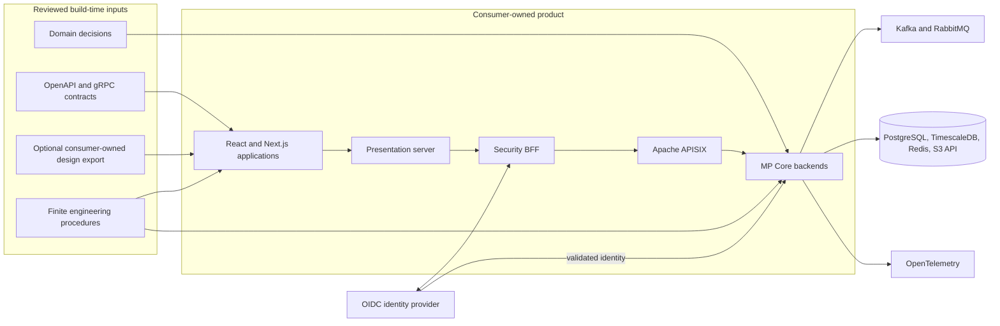
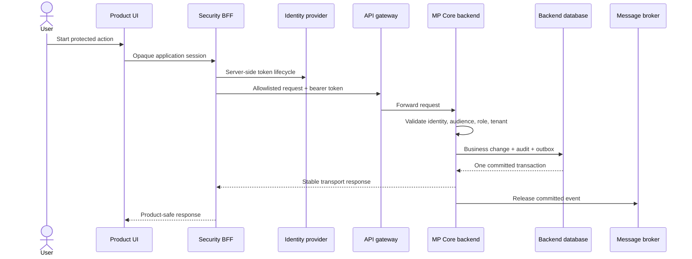

# Architecture

MP Platform separates reusable foundations, consumer-owned products, and infrastructure integration
boundaries. The separation lets teams adopt the backend, frontend, or both without making one repository
the source of truth for every concern.

## System view

The diagram describes the reference shape, not a mandatory vendor bundle. Identity uses OpenID Connect,
telemetry uses OTLP, object storage uses the S3 API, and edge forwarding follows explicit HTTP/gRPC
contracts. A consumer may substitute products that satisfy those standards and must then verify the
substitution in its own environment.

## AI execution layer

Finite AI procedures sit at build time, never inside the production authority path. They read approved
repository contracts, bound the change, identify refusal conditions, invoke deterministic tools, and name
the evidence a human must review. Codex and Claude Code use native discovery adapters over the same
canonical procedure bodies; neither agent becomes a source of domain truth.

| Layer | Owns | Does not own |
|---|---|---|
| Human decision gate | Domain meaning, boundaries, acceptance, security posture, publication | Mechanical implementation or repeated verification |
| Canonical skill | Preconditions, workflow, refusal rules, ownership limits, evidence contract | Product-specific decisions that have not been approved |
| Agent adapter | Native repository discovery for Codex or Claude Code | A forked version of the engineering procedure |
| Deterministic tooling | Generation, validation, ownership checks, build and test execution | Interpretation of business or visual acceptance |
| Evidence gate | Observed results and named limitations | Automatic permission to commit, release, or deploy |

The complete procedure inventory and agent lifecycle are documented in [AI engineering](ai-engineering.md).

## Trust boundaries

| Boundary | Rule |
|---|---|
| Browser to product server | The browser receives an opaque application session, not provider tokens or internal service origins |
| Security BFF to identity provider | Authorization Code with PKCE establishes the provider session; refresh and revocation stay server-side |
| BFF to gateway | Only allowlisted product operations cross the presentation boundary |
| Gateway to backend | The gateway may pre-validate a token, but every protected backend validates identity, audience, role, and tenant again |
| Service to service | A service uses its own identity and a bounded contract; it does not impersonate the browser |
| Service to broker | Business changes and their outgoing messages commit together; consumers use durable inbox behavior |
| Product to design source | The product owns its design rights and reviewed export; MP Frontend neither mutates nor republishes the source |
| Product to foundation | Product behavior stays in the consumer repository; reusable defects are fixed in the owning foundation |
| Agent to repository | The agent receives repository-scoped procedures and bounded ownership; it may not silently replace human decisions or report unobserved evidence |

## Build-time ownership

MP Frontend normalizes reviewed API and optional design inputs into a pinned local contract. Generated
files have declared ownership and deterministic verification. Handwritten adapters own product behavior,
copy, brand, and interaction decisions.

Its public MVP implements code-first `none` and consumer-owned `existing` design-source paths. It does
not ship a Community DLS or accept the legacy public-template mode. The complete lifecycle and future
release boundary are documented in [Design-source paths](design-sources.md).

MP Core templates and CLI generate the technical shell selected by the team. Domain rules, use cases,
messages, and policies remain in the generated consumer repository. A foundation package does not own a
consumer's aggregate or bounded-context decisions.

## Runtime ownership

## Reference implementations

Tiffin proves the complete path with customer and operations applications, Keycloak, APISIX, nine MP Core
services, PostgreSQL, TimescaleDB, Redis, Kafka, RabbitMQ, and an S3-compatible media store. RustFS is the
default reference store; SeaweedFS is an explicit alternative exercised by a second scenario matrix.

Storefront is the smaller backend learning path: a commerce modular monolith plus Fulfillment and
Analytics services. It demonstrates how the same foundation supports a mixed modular-monolith and service
topology.

## Deliberate non-goals

MP Platform does not provide a hosted control plane, a universal business model, a public Figma library,
an identity provider fork, an API gateway fork, or a production deployment certification. Each consumer
owns deployment topology, capacity, regulatory controls, incident response, secret custody, and the
acceptance evidence for its environment.
