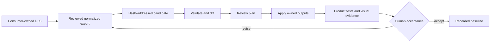

# Design-source paths

MP Frontend separates product design ownership from framework ownership. A team can start without Figma,
connect a design system it already owns, or evaluate a future MP Community design system if one is ever
released. Only the first two paths exist in the public MVP.

<picture>
  <source media="(prefers-color-scheme: dark)" srcset="images/design-sources-dark.svg">
  <source media="(prefers-color-scheme: light)" srcset="images/design-sources-light.svg">
  
</picture>

## Current contract

| Path | CLI mode | MVP status | Who owns the design | What MP Frontend does |
|---|---|---|---|---|
| Code-first | `none` | **Implemented** | Consumer owns code tokens, components, and product composition | Creates a usable workspace in `disabled` design-source state; an approved existing source can be attached later |
| Bring your own DLS | `existing` | **Implemented** | Consumer owns the Figma/DLS, binding, export, assets, mappings, and distribution rights | Attaches and hash-checks a finite local contract; provides reviewed import, diff, plan, apply, accept, and drift-check commands |
| MP Community DLS | no accepted MVP mode | **Not available in the MVP** | Would require a separately licensed, sanitized, versioned public source | The legacy `mpfrontend` template mode is refused so configuration cannot promise a library that has not shipped |

The third path is a documented product direction, not a hidden feature flag and not a prerequisite for
using MP Frontend. No public Figma Community DLS is required, fetched, copied, or published by the MVP.
If that path is introduced later, it must arrive with a public source, license, immutable version,
compatibility policy, sanitized assets and metadata, CLI implementation, clean-consumer evidence, and
separate release approval.

## Path A: code-first

```bash
mpfrontend init \
  --name acme-portal \
  --directory ./acme-portal \
  --design-source none \
  --json
```

This is a complete starting point. It is not a degraded mode. The product may use MP Frontend packages,
contracts, Security BFF, realtime foundation, localization, themes, and Base AI procedures while keeping
its design tokens and components in code.

## Path B: consumer-owned existing DLS

```bash
mpfrontend init \
  --name acme-portal \
  --directory ./acme-portal \
  --design-source existing \
  --json

mpfrontend design attach \
  --directory ./acme-portal \
  --source existing \
  --binding ./design.binding.json \
  --dry-run \
  --json

mpfrontend design attach \
  --directory ./acme-portal \
  --source existing \
  --binding ./design.binding.json \
  --json

mpfrontend design status --directory ./acme-portal --json
```

The lifecycle uses a reviewed local export:



Import never makes a baseline by itself. Apply owns only declared generated outputs such as token CSS and
component metadata. Product adapters, React behavior, typography, composition, accessibility, assets,
copy, and tests remain authored responsibilities unless a reviewed mapping explicitly states otherwise.

## What the connector does not do

MP Frontend does not:

- connect directly to Figma or request a Figma credential;
- scrape, mutate, publish, duplicate, or sanitize a Figma file;
- infer missing component behavior or distribution rights;
- turn component metadata into accepted React implementation;
- run visual, keyboard, RTL, contrast, or asset-rights review on behalf of the responsible team;
- promote an imported candidate merely because the build passes.

An attachment proves local byte identity, not legal rights or design quality. Private file keys, raw
exports, licensed assets, confidential metadata, and machine-local paths stay outside public repositories.

## Generated and authored ownership

| MP Frontend may own | The product team continues to own |
|---|---|
| Hash-addressed candidate and lifecycle state | Original design source and export rights |
| Generated token CSS in the declared output directory | Semantic decisions, naming, modes, and brand policy |
| Generated component registry metadata | Component implementation, interaction, copy, and composition |
| Plan, receipt, hashes, and drift evidence | Unit, type, visual, RTL, keyboard, contrast, and rights acceptance |

Unknown mappings, unresolved behavior or rights, stale plans, symlinks, path traversal, concurrent writers,
and unowned output collisions fail closed. There is no force-overwrite path.

## How AI procedures participate

The four Design skills—`mpfrontend-import-design-system`, `mpfrontend-sync-design-tokens`,
`mpfrontend-reconcile-design-components`, and `mpfrontend-review-design-drift`—follow this lifecycle. They
inspect the selected source mode and preserve it. They cannot attach a private source, accept a baseline,
or publish design material merely to complete a task.

Install them only when the consumer needs the reviewed design workflow:

```bash
mpfrontend skills install \
  --directory ./acme-portal \
  --for both \
  --profile design \
  --dry-run \
  --json
```

For the full procedure model, folder layout, and human decision gates, continue to
[AI engineering](ai-engineering.md). The detailed command and schema contract remains authoritative in
the [MP Frontend design-sync guide](https://github.com/panahister/mpfrontend/blob/main/packages/ftg-cli/DESIGN-SYNC.md).
