# Engineering workflows and placement rules

MP Platform uses explicit conventions so a developer or coding agent can make the same placement decision
without rediscovering the repository structure for every feature. The framework repositories own reusable
technical policy; product repositories own business behavior, composition, brand, and acceptance.

## One API-backed feature across the ecosystem

```mermaid
flowchart LR
  STORY[Approved story and examples] --> BACKEND[Owning backend context]
  BACKEND --> CONTRACT[Versioned API contract]
  CONTRACT --> CAPTURE[Frontend captured OpenAPI]
  CAPTURE --> GENERATE[Finite generated models and validators]
  GENERATE --> UI[Customer or Operations feature]
  UI --> FOCUSED[Focused backend and frontend tests]
  FOCUSED --> RUNTIME[Hybrid or Frontend Mode journey]
  RUNTIME --> REVIEW[Evidence and human review]
```

The contract is the handoff, not a shared product assembly. Backend rules remain authoritative. Frontend
generation validates selected external shapes; it does not generate product experience or permissions.

## Frontend placement in one minute

| Change | Default destination |
|---|---|
| Customer-only journey, copy, state, or composition | Customer app feature |
| Operator, restaurant, courier, or governance journey | Admin/Operations app feature |
| One stable product concept used by both surfaces | Product-shared package, after two real callers exist |
| Product design tokens and component semantics | Consumer DLS adapter |
| Session, trusted upstream, token, or response-validation behavior | BFF or presentation server |
| Contract-selected models and validators | Generated output; never hand-edit |
| Domain-neutral capability proved by another product shape | Propose to MP Frontend foundation |

Read the complete [MP Frontend conventions](https://github.com/panahister/mpfrontend/blob/main/docs/FRONTEND-CONVENTIONS.md)
for separation of concerns, state/effect rules, generated ownership, and the review checklist. The Tiffin
reference adds [real CancelOrder and media-upload flows](https://github.com/panahister/mpfrontend-tiffin-reference/blob/main/docs/FRONTEND-CONVENTIONS.md).

## Backend placement in one minute

| Change | Default destination |
|---|---|
| Invariant or valid state transition | Domain aggregate, value, or rule |
| Use-case orchestration, actor/resource authority, expected failure | Application command/query handler |
| Database, broker, object store, identity, or remote-service implementation | Infrastructure adapter behind an application port |
| REST/gRPC mapping, policy, health, channels, and host wiring | API/host composition |
| Agreement between independently deployed contexts | Versioned contract declared on each side and held by contract tests |
| Domain-neutral technical guarantee proved across consumer shapes | Propose to MP Core foundation |

Read the complete [MP Core backend conventions](https://github.com/panahister/mpcore/blob/main/docs/BACKEND-CONVENTIONS.md)
for the vertical-slice path, dependency direction, transaction and integration rules, evidence ladder, and
agent stop conditions. Tiffin adds [real PlaceOrder and Media flows](https://github.com/panahister/mpcore-tiffin-sample/blob/main/docs/BACKEND-CONVENTIONS.md).

## Daily change sequence

1. Write the behavior with a success case, refusal case, actor, tenant, and observable result.
2. Name the bounded context and frontend surface that own it.
3. Approve the transport/message contract, failures, authorization, idempotency, and compatibility.
4. Implement the backend inward-out: Domain, Application, Infrastructure, API.
5. Update the checked-in frontend contract input and select the operation in the owning app.
6. Generate and inspect; never patch generated output.
7. Bind at the trusted server boundary, then implement feature orchestration and UI.
8. Run focused tests on both sides, contract/architecture checks, generated drift, and uncached repository gates.
9. Use Hybrid Mode for backend breakpoints or Frontend Mode for UI/BFF debugging against the same real
   product boundaries.
10. Report exact evidence and obtain human review. A local pass is not a production certification.

## Stop rather than guess

A developer or agent stops when ownership, business rules, permission, contract shape, compatibility,
failure policy, target surface, or design authority is ambiguous. It does not create a shared package,
foundation abstraction, role, endpoint, or business default merely to finish the change.

