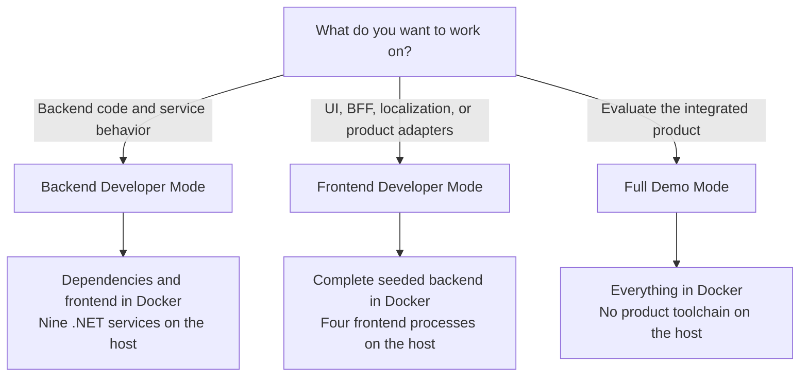

# Run the Tiffin reference

Tiffin is the integrated MP Platform reference: nine independently secured .NET services, Customer and
Operations applications, two Security BFFs, Keycloak identity, Apache APISIX at the edge, messaging,
service-owned data, realtime delivery state, and S3-compatible media.

The architecture is identical in every local workflow. Only the host/container boundary changes.



## One source layout

Every mode uses the same four public repositories. Keep them as siblings so the Docker topology can
build identity, edge, backend, and frontend from their owning source boundaries:

```text
workspace/
├── mpcore-tiffin-sample/          backend, integrated Compose, demo seed
├── mpfrontend-tiffin-reference/   Customer, Operations, BFFs, presentation
├── tiffin-keycloak/               realm, authorization seed, events, theme
└── tiffin-apisix/                 REST/gRPC routes, TLS input, edge policy
```

```bash
mkdir tiffin-workspace
cd tiffin-workspace
git clone https://github.com/panahister/mpcore-tiffin-sample.git
git clone https://github.com/panahister/mpfrontend-tiffin-reference.git
git clone https://github.com/panahister/tiffin-keycloak.git
git clone https://github.com/panahister/tiffin-apisix.git
```

No MP Core source clone is required: Tiffin consumes the published `0.9.3` packages by default. Backend
maintainers may place an `mpcore` clone beside Tiffin when they explicitly want the sample to build
against framework source.

## Compare the workflows

| | Backend Developer | Frontend Developer | Full Demo |
|---|---|---|---|
| Primary audience | Backend engineers | Frontend engineers | Reviewers and first-time evaluators |
| Docker runs | Dependencies, identity, edge, frontend | Complete seeded backend, identity, and edge | Entire product |
| Host runs | Nine .NET services | Customer, Operations, and both BFFs | Nothing |
| Host prerequisites | Docker, .NET `10.0.400`, `jq`, `curl`, `grpcurl`; protobuf tooling on Apple Silicon; Node/pnpm only to rebuild frontend | Docker, Node.js `24.19.0`, pnpm `11.25.0` | Git and Docker with at least 10 GB available |
| Breakpoint boundary | Any backend service | Presentation or BFF processes | Container logs only |
| Seed behavior | Explicit product-API seed after services start | Automatic and idempotent | Automatic and idempotent |
| Best feedback loop | Service rebuild/restart or IDE | Next.js hot reload and host Node debugging | Repeated evaluation with cached images |

RustFS is the default media store in every mode. SeaweedFS remains an explicit, tested alternative; it
is not a hidden fallback. The local topologies are reference profiles, not production security or HA
acceptance.

## Mode 1: Backend Developer

Use this mode for business slices, migrations, service contracts, message flows, and scenario debugging.
Infrastructure stays reproducible in Docker, while the nine .NET processes remain visible to the IDE.

```bash
cd mpcore-tiffin-sample
scripts/up.sh
scripts/setup.sh
scripts/run.sh all
python3 scripts/seed-us-poc.py
```

Then build and start the frontend containers:

```bash
cd ../mpfrontend-tiffin-reference
node scripts/verify-core-artifacts.mjs
pnpm install --frozen-lockfile
docker compose -f compose.local.yaml up --detach --build --wait
```

Run all sixteen backend stories when the change is ready for connected verification:

```bash
cd ../mpcore-tiffin-sample
scripts/scenarios.sh
```

To debug a single service, stop the corresponding launcher process and run its API project in the IDE
with `ASPNETCORE_ENVIRONMENT=Development`. The backend
[running guide](https://github.com/panahister/mpcore-tiffin-sample/blob/main/docs/running.md) lists every
service solution, port, log, and focused-scenario command.

Stop without deleting state:

```bash
cd ../mpfrontend-tiffin-reference
docker compose -f compose.local.yaml down

cd ../mpcore-tiffin-sample
scripts/run.sh stop
scripts/down.sh
```

## Mode 2: Frontend Developer

Use this mode for Customer or Operations UI, BFF composition, generated-contract integration,
localization, themes, and realtime presentation work. The developer does not need the .NET SDK or the
backend process topology on the host.

Start the complete backend and US demo dataset in Docker:

```bash
cd mpcore-tiffin-sample
scripts/full-demo.sh up-backend
```

Run the editable frontend from source:

```bash
cd ../mpfrontend-tiffin-reference
node scripts/verify-core-artifacts.mjs
pnpm install --frozen-lockfile
pnpm dev:product
```

The launcher starts Customer, Operations, and both Security BFFs. The web runtimes use Next.js
development mode; the BFFs keep provider tokens behind the server boundary and use the containerized
Redis validation profile. Press `Ctrl+C` once to stop all four host processes. The backend and its demo
data remain running, so another frontend session starts quickly.

Stop the Docker backend later without deleting its data:

```bash
cd ../mpcore-tiffin-sample
scripts/full-demo.sh down
```

Read the frontend
[local-development guide](https://github.com/panahister/mpfrontend-tiffin-reference/blob/main/docs/LOCAL-DEVELOPMENT.md)
for focused verification, trust details, and frontend-specific troubleshooting.

## Mode 3: Full Demo

Use this mode when the goal is to see the product rather than edit one runtime. Git and Docker are the
only host prerequisites.

```bash
cd mpcore-tiffin-sample
scripts/full-demo.sh up
```

The command:

1. builds the nine backend services from the checked-out backend source;
2. builds Customer, Operations, and both BFFs from the checked-out frontend source;
3. builds the Tiffin Keycloak runtime and mounts its realm, authorization model, event provider, and theme;
4. renders the local APISIX configuration and certificate from the gateway source;
5. starts data, messaging, identity, edge, business, and web runtimes in dependency order;
6. waits for real health checks; and
7. seeds four US restaurants, twelve menu items, and twelve media objects through authenticated product APIs.

The first build can take several minutes because it restores .NET and Node dependencies. Later starts
reuse Docker layers and persistent data. The seed is idempotent, so a normal restart does not duplicate
restaurants or menu items.

## URLs and lifecycle

| Surface | URL |
|---|---|
| Customer | `http://localhost:4411` |
| Operations | `http://localhost:4412` |
| Keycloak | `http://localhost:38180` |
| APISIX HTTPS edge | `https://localhost:39443` |
| Media S3 API | `http://localhost:39000` |
| RabbitMQ management | `http://localhost:35673` |

Use the Tiffin frontend
[demo guide](https://github.com/panahister/mpfrontend-tiffin-reference/blob/main/docs/DEMO-GUIDE.md)
for the correct demo identity for Customer, restaurant, and courier journeys.

Inspect the integrated runtime:

```bash
scripts/full-demo.sh status
scripts/full-demo.sh logs
```

Stop containers while preserving databases, identity, queues, and media:

```bash
scripts/full-demo.sh down
```

Delete named demo volumes only when a clean local state is intentional:

```bash
scripts/full-demo.sh reset
```

Add `--observability` to a containerized `up` command to include OpenTelemetry Collector, Prometheus,
Grafana, Jaeger, and Kafka UI. Select the retained alternative media store with:

```bash
MEDIA_STORE=seaweedfs scripts/full-demo.sh up
```

## Avoid port collisions

The modes intentionally keep the same browser and service origins. Stop one mode before starting
another. In particular:

- Full Demo owns `4411`, `4412`, and the backend service ports.
- Frontend Developer Mode leaves `4411` and `4412` free, but owns the backend service ports.
- Backend Developer Mode owns those service ports from host .NET processes.

A failed start caused by an occupied port is a lifecycle conflict, not a reason to change the published
origins or weaken OIDC validation.

## What these modes prove

All three modes exercise the same source boundaries and runtime architecture. Full Demo proves that a
new evaluator can build and start the integrated POC without installing both product toolchains.
Frontend and Backend Developer modes prove that each discipline can retain a practical debugger and
feedback loop without replacing another boundary with mocks.

They do not prove production HA, TLS and key custody, backup/restore, load and soak capacity, regional
failover, formal accessibility acceptance, or deployment approval. See [Maturity](maturity.md) before
turning local evidence into a production claim.
